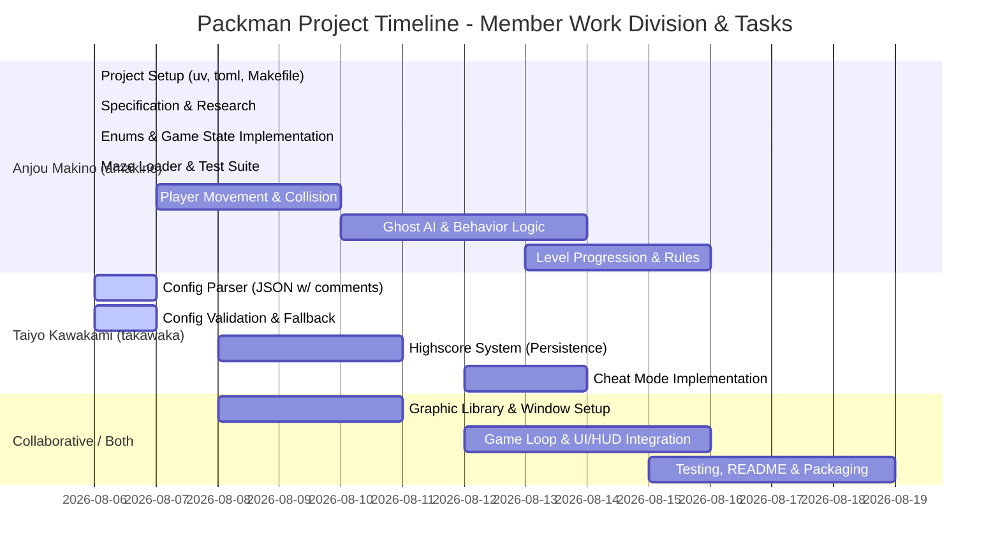

2026
0806 amakino enums.py game_state.py maze_loader.py作成
0806 takawaka 書いて！！後でAIにまとめさせよう！！
0807 amakino バグ修正、configデータ格納　キャラクタのbasemodell class開始
0808 amakino blinkyとかpacmanのクラス作ってて、順番違うなって気づいて中断。グラッフィック開始。　config.jsonのコメントアウト全対応を試みる(reを使用)
0808 amakino Claude Codeにレビューさせてバグ一斉修正。ghoast.pyのNameError、blinky未実装、テスト崩壊、config.livesデフォルト不整合、コメント除去の文字列破壊、config検証の全滅フォールバック、パックマン初期位置が真ん中じゃない、壁にめり込む表示バグ(当たり判定と描画の半径不一致)など。flake8/mypy/pytest全部通るようになった。

