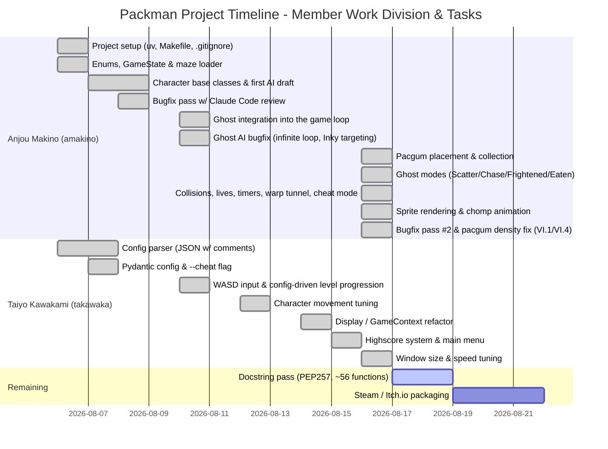

2026
0806 amakino enums.py game_state.py maze_loader.py作成
0806 takawaka 書いて！！後でAIにまとめさせよう！！
0807 amakino バグ修正、configデータ格納　キャラクタのbasemodell class開始
0808 amakino blinkyとかpacmanのクラス作ってて、順番違うなって気づいて中断。グラッフィック開始。　config.jsonのコメントアウト全対応を試みる(reを使用)
0808 amakino Claude Codeにレビューさせてバグ一斉修正。ghoast.pyのNameError、blinky未実装、テスト崩壊、config.livesデフォルト不整合、コメント除去の文字列破壊、config検証の全滅フォールバック、パックマン初期位置が真ん中じゃない、壁にめり込む表示バグ(当たり判定と描画の半径不一致)など。flake8/mypy/pytest全部通るようになった。
0810 amakino 進捗棚卸し。pygameでのメインループ・パックマン4方向移動＆壁判定は動く状態。Blinkyの追跡ロジックは実装済みだがまだdisplay.pyのループに1体も出現させてない（統合待ち）。ドット/パワーペレット・スコア加算・ハイスコア永続化・HUD・ゴースト接触判定は未着手。Windows側の改行コード(CRLF)がまざってた分をコミットで正規化。次はBlinky統合→残り3体のゴースト実装→モード切替の順で着手予定。
ピンキー作った
0810 amakino Clyde実装、display.pyにゴースト4体を統合（四隅出現・毎フレームupdate・描画）
0810 takawaka WASD移動対応、Configでレベルごとの幅・高さを指定できるレベル進行の仕組みを追加（DEFAULT_LEVELSで最低10レベルに自動補完、Display.advance_to_next_levelでレベル遷移）
0812 takawaka ghostの動きを改善し個性に合わせしっかりと追跡するようにした。pacmanの動きを改善
0814 takawaka DisplayがConfigではなくPacmanGameContextを受け取るようにリファクタ
0815 takawaka ハイスコアシステム（永続化・上位10件・名前入力）とメインメニュー/ハイスコア画面/操作説明画面を実装
0816 amakino パグムの配置・回収・スコア加算を実装。ゴーストのGhostMode切替（Scatter/Chase/Frightened/Eaten）、Pacman-ゴースト接触判定（残機減少・リスポーン）、タイムリミット処理、ワープトンネル、チートモードの効果（無敵・レベルスキップ・ゴースト凍結・残機増加・速度上昇）、HUD、画像スプライト描画・パックマンのパクパクアニメーションを実装。README（英語+日本語）を執筆。
0816 takawaka ウィンドウサイズ・キャラクター速度を調整
0816 amakino 課題PDFを読み直して監査。バグ2件（レベル間でタイマーが引き継がれる、迷路生成失敗時にクラッシュする）とUI不足（Victory画面に祝福メッセージが無い）を修正。パグムの配置を「ほとんどの通路を埋める」仕様（VI.1/VI.4）に合わせて個数上限を撤廃。

