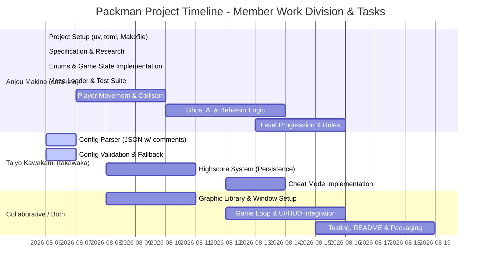

```mermaid
gantt
    title Packman Project Timeline - Member Work Division & Tasks
    dateFormat  YYYY-MM-DD
    
    section Anjou Makino (amakino)
    Project Setup (uv, toml, Makefile) :done, a1, 2026-08-06, 2026-08-06
    Specification & Research           :done, a2, 2026-08-06, 2026-08-06
    Enums & Game State Implementation  :done, a3, 2026-08-06, 2026-08-06
    Maze Loader & Test Suite           :done, a4, 2026-08-06, 2026-08-06
    Player Movement & Collision        :        a5, 2026-08-07, 2026-08-10
    Ghost AI & Behavior Logic          :        a6, 2026-08-10, 2026-08-14
    Level Progression & Rules          :        a7, 2026-08-13, 2026-08-16

    section Taiyo Kawakami (takawaka)
    Config Parser (JSON w/ comments)   :active, t1, 2026-08-06, 2026-08-07
    Config Validation & Fallback       :active, t2, 2026-08-06, 2026-08-07
    Highscore System (Persistence)     :        t3, 2026-08-08, 2026-08-11
    Cheat Mode Implementation          :        t4, 2026-08-12, 2026-08-14

    section Collaborative / Both
    Graphic Library & Window Setup     :        j1, 2026-08-08, 2026-08-11
    Game Loop & UI/HUD Integration     :        j2, 2026-08-12, 2026-08-16
    Testing, README & Packaging        :        j3, 2026-08-15, 2026-08-19
```